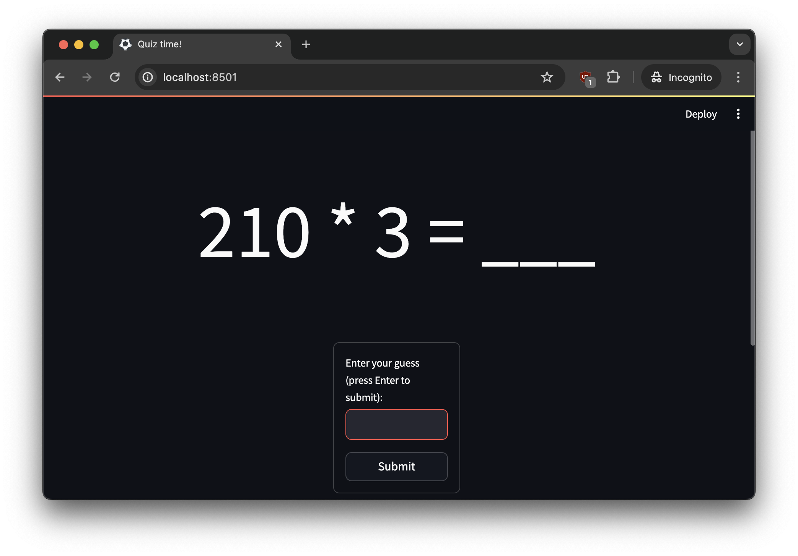

# SumChef

SumChef is a Python library for generating targeted maths quizzes that exercise specific skills and difficulties. Check out [my blog post](https://robertheaton.com/sumchef) for the story behind its creation.

## Example usage

Suppose you want to use SumChef to generate an infinite stream of questions where:

* `A*B + C*D = E`
* The addition crosses a 10 boundary
* `A*B < 20`
* And all variables are between 2 and 100
* (Eg: `4*2 + 24*3 = __`)

To do this you'd write:

```python
from sumchef import *

# Declare the variables
var_names = ["a", "b", "c", "d", "e"]
a, b, c, d, e = variables(var_names)

# Declare the form of the equation
lhs = Add(Multiply(a, b), Multiply(c, d))
rhs = e

# Declare the constraints
constraints = [
    AdditionCrosses10Boundary(Multiply(a, b), Multiply(c, d)),
    IsLessThan(Multiply(a, b), Lit(20)),
    Equal(lhs, rhs),
]
domains = uniform_domains(var_names, range(2, 100))

# Find variable bindings that form a valid equation
bindings = find_bindings(var_names, domains, constraints, 10)

# Print each set of bindings as an equation with a value held out
for bnd in bindings:
    hold_out = random.choice([a, b, c, d, e])
    lhs_expr = expression_string(lhs, bnd, hold_out=hold_out)
    rhs_expr = expression_string(rhs, bnd, hold_out=hold_out)
    print(f"{lhs_expr} = {rhs_expr}")
```

This prints:

```
9 * 2 + __ * 2 = 86
4 * 2 + 24 * 3 = __
2 * _ + 16 * 3 = 60
6 * 2 + _ * 6 = 60
_ * 8 + 3 * 6 = 34
4 * 2 + _ * 3 = 32
_ * 2 + 13 * 4 = 60
8 * 2 + 2 * 29 = __
4 * 2 + 17 * _ = 93
5 * 3 + __ * 3 = 93
```

## Advanced usage

You don't have to print the questions as a static worksheet though! You have programmatic access to the questions' contents and you can do anything you want with them. You can put them on a website, or a game, or an app. Your code knows what the correct answer to each question is, so it can check whether the player's answer is correct. You can even automatically adjust the difficulty of the generated questions based on how the player does.

See the streamlit app in `examples/` for inspiration.



## Features

- Create equations with variables, literals, and arithmetic operations (addition, subtraction, multiplication)
- Generate solutions that satisfy all constraints
- Format expressions as strings with support for hiding or highlighting specific variables
- Built-in support for various mathematical constraints:
  - Equality between expressions
  - Greater than/less than comparisons
  - Divisibility checks
  - Addition crossing 10s/100s boundaries
  - N-of conditions for multiple constraints
- Extendible to cover any new constraint

## Installation

```bash
pip install sumchef
```

## Example Applications

### Interactive Maths Quiz App

The repository includes an example Streamlit application that creates an interactive maths practice interface. To run the example:

```bash
cd examples
pip install streamlit
streamlit run quiz_app.py
```

## API Reference

### Value Classes

- `Variable(name: str)`: Represents a variable in an expression
- `Lit(val: int)`: Represents a constant value
- `Add(operand1: Value, operand2: Value)`: Addition operation
- `Subtract(operand1: Value, operand2: Value)`: Subtraction operation
- `Multiply(operand1: Value, operand2: Value)`: Multiplication operation

### Constraint Classes

- `Equal(operand1: Value, operand2: Value)`: Enforces equality between two expressions
- `IsLessThan(value: Value, threshold: Value)`: Ensures a value is less than a threshold
- `IsGreaterThan(value: Value, threshold: Value)`: Ensures a value is greater than a threshold
- `IsDivisibleBy(value: Value, divisible_by: Value)`: Checks divisibility
- `AdditionCrosses10Boundary`, `AdditionCrosses100Boundary`: Special constraints for addition properties
- `NOf(sub_constraints: list[Constraint], n: int)`: Ensures exactly n sub-constraints are satisfied

### Utility Functions

- `variables(names: list[str]) -> list[Variable]`:
  Create multiple Variable objects with the given names
- `find_bindings(variables: list[str], domains: dict[str, list[int]], constraints: list[Constraint], n_bindings: int = 1) -> list[dict[Variable, int]]`: 
  Find solutions that satisfy all constraints
- `expression_string(expression: Value, values: dict[Variable, int], hold_out: Variable | None = None, underline: Variable | None = None) -> str`:
  Format an expression as a string, with options to hide or highlight specific variables
- `uniform_domains(variables: list[str], domain: Sequence[int]) -> dict[Variable, list[int]]`:
  Create a dictionary mapping each variable to the same domain

## Creating Custom Constraints

You can create custom constraints by subclassing the `Constraint` abstract base class. Each constraint needs to implement two methods:

1. `is_satisfied(self, bindings: dict[Variable, int]) -> bool`: 
   - Takes a dictionary mapping Variable objects to their integer values
   - Returns True if the constraint is satisfied with these values
   - All constraint logic goes here

2. `variables(self) -> list[Variable]`: 
   - Returns a list of all variables used in the constraint
   - Used for efficient constraint checking during solution search
   - Use `filter_variables` to implement - see other classes for details

Here's an example of creating a custom constraint that ensures a value is even:

```python
from sumchef import *

class IsEven(Constraint):
    def __init__(self, value: Value):
        self.value = value

    def is_satisfied(self, bindings: dict[Variable, int]) -> bool:
        return self.value.evaluate(bindings) % 2 == 0

    def variables(self) -> list[Variable]:
        return filter_variables(self.value.variables())
```

Usage:

```python
from sumchef import *

var_names = ["x", "y", "z"]
x, y, z = variables(var_names)

constraints = [IsEven(x), IsEven(y), Equal(Add(x, y), z)]

domains = uniform_domains(var_names, range(100))
solutions = find_bindings(var_names, domains, constraints)
```

This would give you sums where you practice adding only even numbers, like `12 + 38 = 50` and `60 + 14 = 74`. 

Tips for implementing constraints:

- Use the `evaluate()` method on Value objects to get their concrete values
- Use `filter_variables()` helper to properly handle nested expressions
- Keep constraints atomic - complex conditions can be built using `NOf`
- Consider edge cases and performance implications

## Contributing

Contributions are welcome! Please submit a PR.